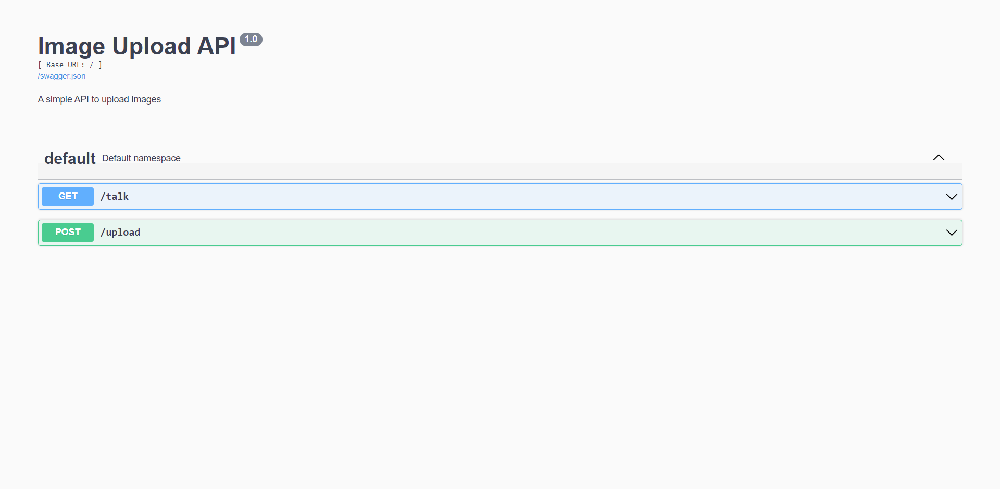
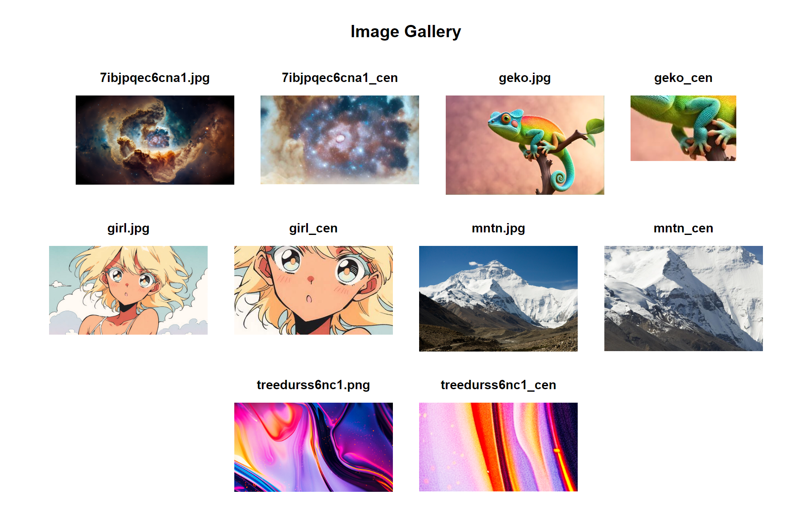

# Microservice Tutorial

In this repository I tried to implement an image editing microservice. At this point our microservice operates in Python and uses RabbiMQ (messaging queue) to communicate with two faux-servers (Python and Java).

## Faux Server (Python & Java Producer)

Theoretically the producers publish an API which allows web-users to upload images into a directory. In our case the directory is shared between the microservice and the server.

At this point we assume that the user has uploaded an image and it is located at `/shared/` directory. 

The full path of said image and the width we want our image to have is passed through the queue at a JSON format.

### Swagger API UI

### Image Gallery

## Image Editor (Consumer)

Our microservice consumes the queue and edits the image we passed.

## Examples

    
    

    
    

